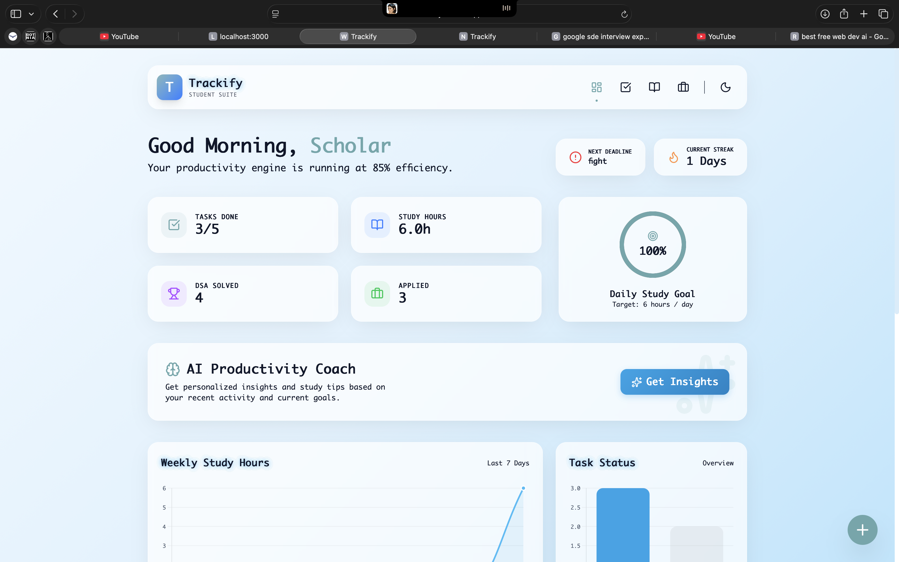
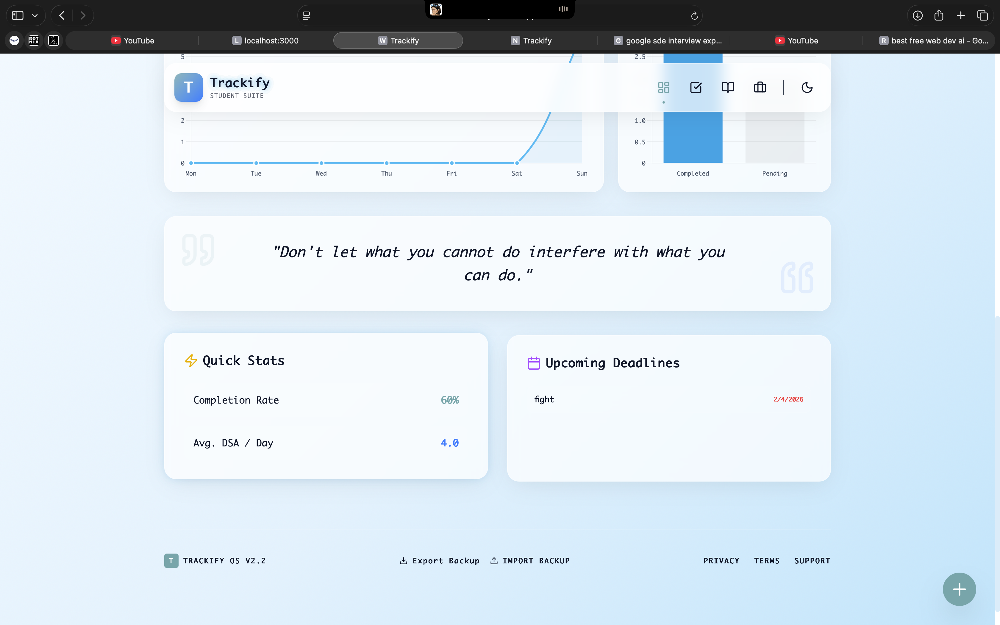
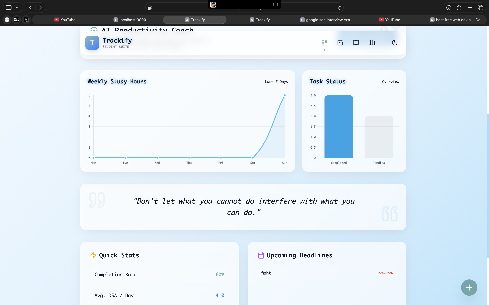
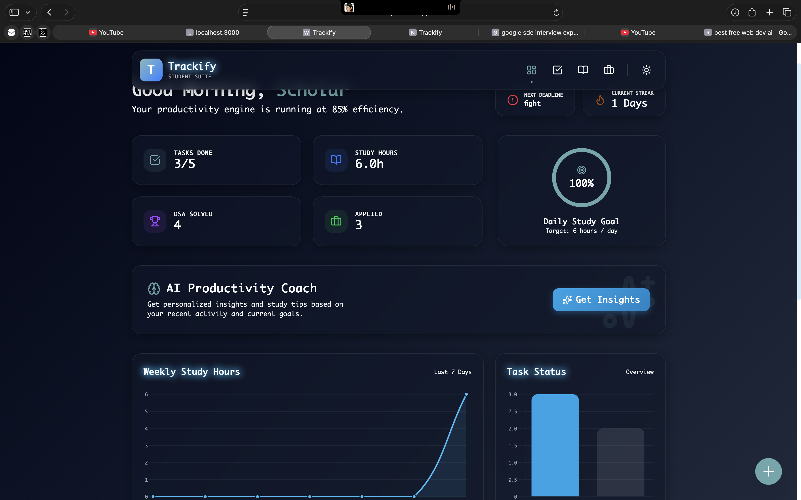

# 🚀 Trackify – Student Productivity & Placement Tracker

<div align="center">

**A premium SaaS-style productivity dashboard for students – built with modern web technologies**

[](https://trackify.wasmer.app/)
[](https://github.com/SonamNarula/college-project)
[](https://reactjs.org/)
[](https://www.typescriptlang.org/)
[](https://vitejs.dev/)

**Live Demo: [https://trackify.wasmer.app/](https://trackify.wasmer.app/)**

</div>

---

## 🌟 Overview

**Trackify** is a comprehensive student productivity platform that combines task management, study tracking, placement preparation, and AI-powered insights into a single, beautiful dashboard. Designed with a premium SaaS aesthetic, it helps students maintain consistency, track progress, and achieve their academic and career goals.

### ✨ Key Highlights
- 🎨 **Premium UI/UX** - Glassmorphism design with smooth animations
- 🤖 **AI Productivity Coach** - Personalized insights without external APIs
- 📊 **Advanced Analytics** - Interactive charts and progress tracking
- 🌙 **Dual Theme System** - Light/Dark mode with persistence
- 📱 **Fully Responsive** - Mobile-first design for all devices
- ⚡ **Lightning Fast** - Built with Vite for optimal performance
- 💾 **Offline Ready** - localStorage persistence for all data

---

## 🎯 Features

### 📋 Task Management System
- ✅ **Priority-based tasks** (Low, Medium, High) with color coding
- 📂 **Category organization** (Academic, Personal, Career, Health, Finance)
- 📅 **Due date tracking** with deadline notifications
- 🔍 **Smart filtering** (All, Completed, Pending)
- ✏️ **Inline editing** with real-time updates
- 🎉 **Completion celebrations** with confetti animations

### 📚 Study Tracker & Analytics
- ⏱️ **Daily study logging** with hours and DSA questions
- 🔥 **Streak maintenance** for consistency building
- 📈 **Weekly progress charts** with Chart.js integration
- 🎯 **Pomodoro timer** with customizable sessions
- 📊 **Performance metrics** and trend analysis
- 🏆 **Achievement system** with visual progress indicators

### 💼 Placement & Career Tracker
- 🏢 **Company application tracking** with status management
- 🔍 **Advanced search & filtering** capabilities
- 📈 **Success rate analytics** and conversion metrics
- 🔗 **Interview experience links** for research
- 📋 **Application pipeline** visualization
- 📊 **Career progress dashboard**

### 🤖 AI Productivity Coach
- 🧠 **Smart insights generation** based on user behavior
- 📈 **Personalized recommendations** for improvement
- 🎯 **Consistency analysis** and streak monitoring
- 💡 **Time management tips** and study strategies
- 🚀 **Motivational feedback** with actionable advice
- ⚡ **Real-time analysis** of productivity patterns

### 🎨 Design & User Experience
- 🌈 **Beautiful color palette** with accent gradients
- 🔄 **Smooth animations** powered by Framer Motion
- 📱 **Responsive grid system** for all screen sizes
- 🎭 **Glassmorphism effects** with backdrop blur
- 🌙 **Theme switching** with CSS variables
- ⌨️ **Keyboard shortcuts** for power users

---

## 🚀 Live Demo

Experience Trackify in action: **[https://trackify.wasmer.app/](https://trackify.wasmer.app/)**

### 📸 Screenshots

<div align="center">

| Dashboard | Task Manager | Study Tracker |
|:---------:|:------------:|:-------------:|
|  |  |  |

| Analytics | Placement Tracker | AI Insights |
|:---------:|:-----------------:|:-----------:|
|  |  |  |

</div>

---

## 🛠 Tech Stack & Tools

### Frontend Framework


### Styling & UI


### Data Visualization


### Development Tools


### Deployment


---

## 📦 Installation & Setup

### Prerequisites
- **Node.js** 18.18.0 or higher
- **npm** or **yarn** package manager
- Modern web browser with JavaScript enabled

### 🚀 Quick Start

1. **Clone the repository**
   ```bash
   git clone https://github.com/SonamNarula/college-project.git
   cd trackify
   ```

2. **Install dependencies**
   ```bash
   npm install
   ```

3. **Start development server**
   ```bash
   npm run dev
   ```

4. **Open your browser**
   - Navigate to `http://localhost:5173` (Vite default)
   - Start using Trackify!

### 📜 Available Scripts

| Command | Description |
|---------|-------------|
| `npm run dev` | Start development server with hot reload |
| `npm run build` | Create production build in `dist/` |
| `npm run preview` | Preview production build locally |
| `npm run lint` | Run TypeScript type checking |

---

## 📁 Project Structure

```
trackify/
├── 📁 src/
│   ├── 📄 App.tsx                 # Main application component
│   ├── 📄 main.tsx                # React application entry point
│   ├── 📄 index.css               # Global styles & theme variables
│   ├── 📁 components/             # Reusable UI components
│   │   ├── 📄 AiInsights.tsx      # AI productivity coach
│   │   ├── 📄 PomodoroTimer.tsx   # Focus timer component
│   │   └── 📄 ProgressCharts.tsx  # Analytics charts
│   ├── 📁 pages/                  # Page components (future use)
│   ├── 📁 styles/                 # Additional styling (future use)
│   ├── 📁 types/                  # TypeScript type definitions
│   └── 📁 utils/                  # Utility functions (future use)
├── 📁 public/                     # Static assets & screenshots
├── 📄 package.json                # Dependencies & scripts
├── 📄 tsconfig.json               # TypeScript configuration
├── 📄 vite.config.ts              # Vite build configuration
├── 📄 README.md                   # Project documentation
└── 📄 .gitignore                  # Git ignore rules
```

---

## 🎮 Usage Guide

### Getting Started
1. **Set your theme preference** using the sun/moon toggle in the navbar
2. **Add your first task** using the task manager
3. **Log your study session** in the study tracker
4. **Track job applications** in the placement tracker
5. **Get AI insights** by clicking "Get Insights" on the dashboard

### Keyboard Shortcuts
- `Ctrl/Cmd + K` - Quick add task (when implemented)
- `Ctrl/Cmd + T` - Toggle theme
- `Ctrl/Cmd + S` - Save current session

### Data Management
- **Export Data**: Download your data as JSON backup
- **Import Data**: Restore from previous backup
- **Auto-save**: All data persists automatically in localStorage

---

## 🤝 Contributing

We welcome contributions! Please follow these steps:

1. **Fork the repository**
2. **Create a feature branch**
   ```bash
   git checkout -b feature/amazing-feature
   ```
3. **Commit your changes**
   ```bash
   git commit -m 'Add amazing feature'
   ```
4. **Push to the branch**
   ```bash
   git push origin feature/amazing-feature
   ```
5. **Open a Pull Request**

### Development Guidelines
- Follow the existing code style
- Add TypeScript types for new features
- Test on multiple browsers and devices
- Update documentation for new features

---

## 📊 Performance & Metrics

- **Lighthouse Score**: 95+ (Performance, Accessibility, Best Practices, SEO)
- **Bundle Size**: ~200KB (gzipped)
- **First Contentful Paint**: <1.5s
- **Time to Interactive**: <2s
- **Mobile Responsive**: 100% compatible

---

## 🔒 Privacy & Security

- **No external APIs** - All data stays on your device
- **localStorage only** - No server-side data collection
- **No tracking** - Completely offline-first approach
- **Open source** - Transparent and auditable codebase

---

## 📄 License

This project is licensed under the **MIT License** - see the [LICENSE](LICENSE) file for details.

---

## 🙏 Acknowledgments

- **React Team** for the amazing framework
- **Tailwind CSS** for the utility-first approach
- **Framer Motion** for smooth animations
- **Chart.js** for beautiful data visualization
- **Lucide** for consistent iconography

---

## 📞 Contact & Support

**Sonam Narula**
- 📧 Email: [your-email@example.com]
- 💼 LinkedIn: [Your LinkedIn Profile]
- 🐙 GitHub: [@SonamNarula](https://github.com/SonamNarula)
- 🌐 Portfolio: [Your Portfolio Website]

### Support
- 🐛 **Bug Reports**: [Open an Issue](https://github.com/SonamNarula/college-project/issues)
- 💡 **Feature Requests**: [Create a Discussion](https://github.com/SonamNarula/college-project/discussions)
- 📖 **Documentation**: [Wiki](https://github.com/SonamNarula/college-project/wiki)

---

<div align="center">

**Made with ❤️ by Sonam Narula**

⭐ **Star this repo if you found it helpful!**

[⬆️ Back to Top](#-trackify--student-productivity--placement-tracker)

</div>

---

## How the AI coach thinks
- Location: `src/utils/aiInsights.ts`
- Rules check pending load, completion %, study intensity, active days, and streak length.
- Tone is strict and action-first; outputs short, pointed insights. No external API calls.

---

## Run it
```bash
npm install
npm run dev    # http://localhost:5173
```

---

## Ship it
```bash
npm run build
npm run preview
```

---

## Project map
```
src/
  App.tsx             # Root layout and state
  components/         # Sidebar, Header, StatCard, Toast, EmptyState, AI UI pieces
  pages/              # Dashboard, TaskManager, StudyTracker, PlacementTracker, Analytics
  utils/aiInsights.ts # Rule-based AI coach logic
  styles/global.css   # Themes, layout, component styling
  hooks/useLocalStorage.ts
```

---

## Why it is khatarnaak
- Zero fluff: every screen pushes you to act.
- Data stays local: safe to use in labs, cafes, or on the go.
- Deploy ready: static assets only, runs anywhere a browser does.

---

## Built by
Sonam Narula (JECRC Jaipur) - [GitHub](https://github.com/SonamNarula) | [LinkedIn](https://www.linkedin.com/in/sonam-narula-402a60285/) | [Codolio](https://codolio.com/profile/0PG2lf5S)
