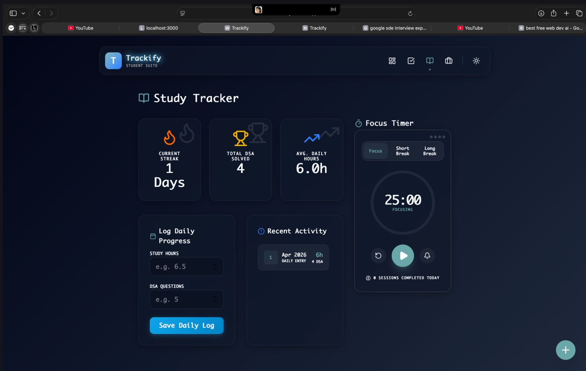
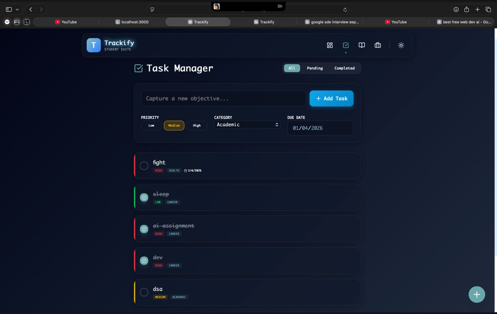
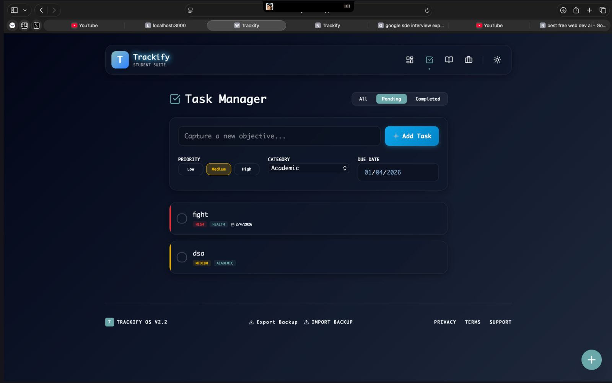
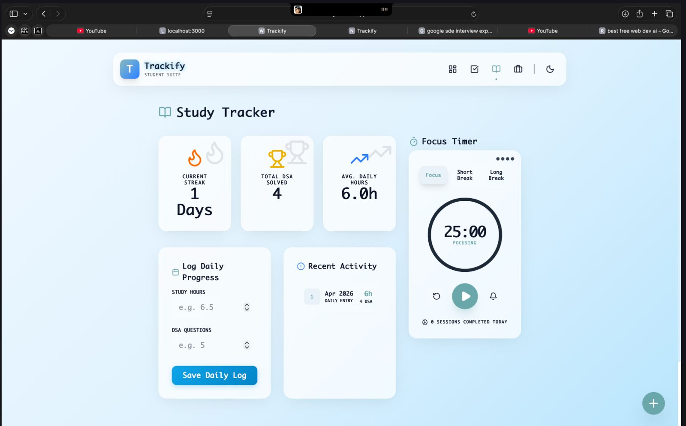
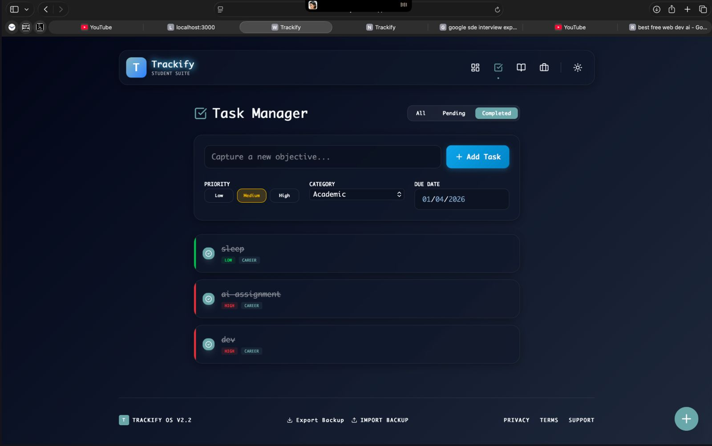
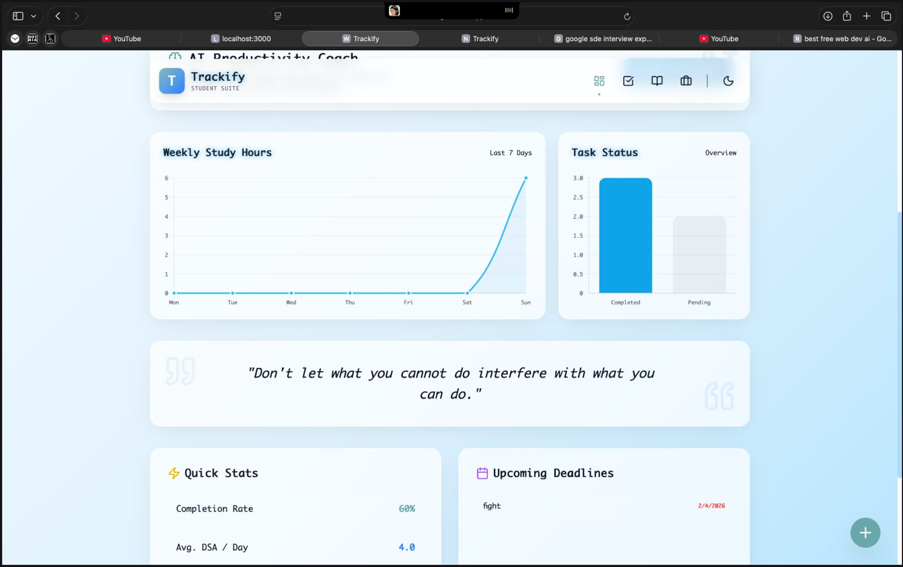
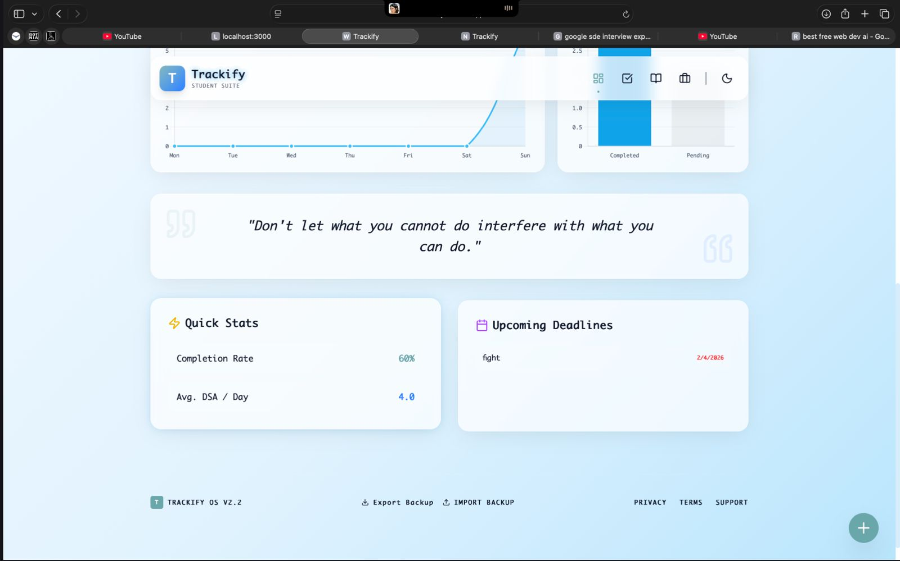
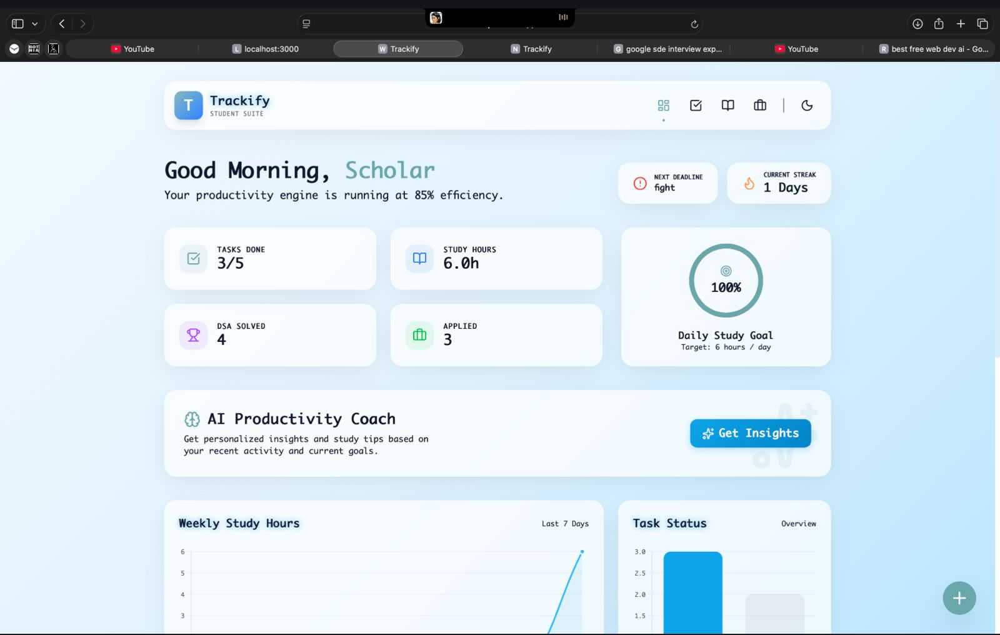
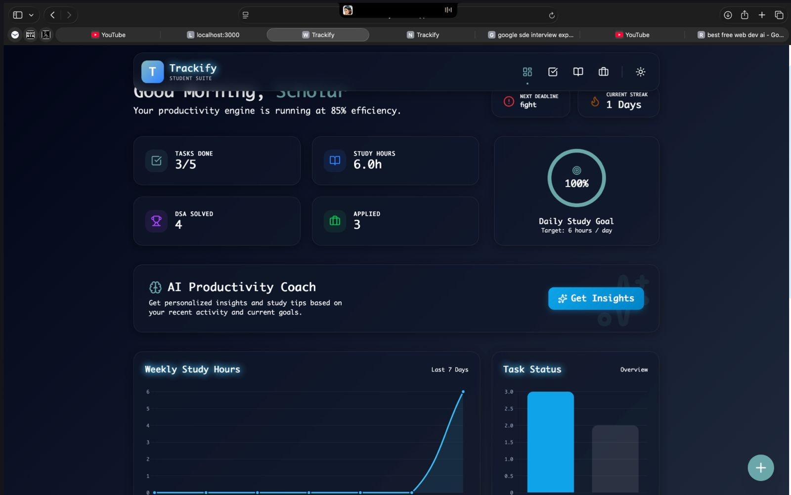
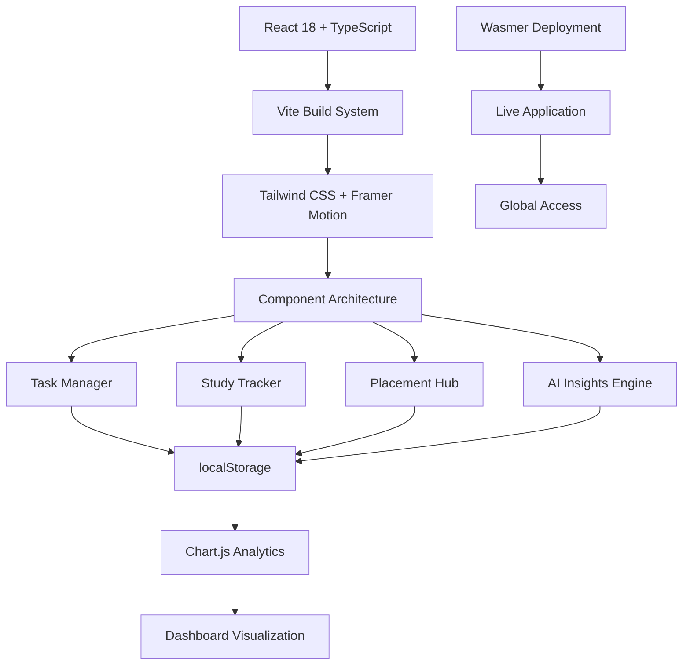

<div align="center">

# 🚀 Trackify — Student Productivity & Placement Tracker

### Built Different · No BS · Pure Grind Mode

<div align="center">

# 🚀 Trackify — Student Productivity & Placement Tracker

### Built Different · No BS · Pure Grind Mode

[](https://trackify.wasmer.app)

---

## 📸 Screenshots

<div align="center">









</div>

---

## ⚡ Features

- ✅ **Task Management**: Priority-based system with smart categorization
- 📚 **Study Tracking**: Streak counters, Pomodoro timer, DSA progress logging
- 💼 **Placement Pipeline**: Full job application tracking with success metrics
- 📊 **Real-time Analytics**: Visual insights that actually matter
- 🤖 **AI Coach**: Rule-based insights that call you out on your BS
- 🌙 **Dark/Light Mode**: Looks fire in both themes
- 📱 **Mobile-First**: Responsive design that works everywhere

**Zero login. Zero server. Zero tracking. Just open and execute.**
- 📱 **Mobile-First**: Responsive design that works everywhere
  
  
  
  
  
  
  
  
- 📚 **Study Tracking**: Streak counters, Pomodoro timer, DSA progress logging
- 💼 **Placement Pipeline**: Full job application tracking with success metrics
- 📊 **Real-time Analytics**: Visual insights that actually matter
- 🤖 **AI Coach**: Rule-based insights that call you out on your BS
- 🌙 **Dark/Light Mode**: Looks fire in both themes
- 📱 **Mobile-First**: Responsive design that works everywhere

**Zero login. Zero server. Zero tracking. Just open and execute.**

---

## ⚡ Key Features

<div align="center">

| 🚀**Task Management** | 📚**Study Tracking** | 💼**Placement Hub** | 🤖**AI Insights** |
| :-------------------------: | :------------------------: | :-----------------------: | :----------------------: |
|   ✅ Priority-based tasks   |  ⏱️ Daily study logging  |  🏢 Application tracking  | 🧠 Smart recommendations |
|  📂 Category organization  |   🔥 Streak maintenance   |    🔍 Advanced search    | 📈 Performance analysis |
|   📅 Due date management   |    📊 Weekly analytics    |    📈 Success metrics    |   🎯 Goal optimization   |
|    🎉 Completion rewards    |     🎯 Pomodoro timer     |  🔗 Interview resources  |    💡 Actionable tips    |

</div>

---

</div>

### 💼 Career Pipeline

<div align="center">

#### Light Mode

### `<div align="center">`

</div>

---

## 🛠 Tech Stack

<div align="center">

### **Core Framework**


### **Styling & UI**


### **Data Visualization**


### **Development Tools**


### **Deployment & Hosting**


</div>

---

## 🏗️ Architecture

<div align="center">



**Modern React Architecture with Offline-First Design**

</div>

---

## 🚀 Installation

### Prerequisites

- **Node.js** 18.18.0 or higher
- **npm** or **yarn** package manager
- Modern web browser with JavaScript enabled

### Quick Start

1. **Clone the repository**

   ```bash
   git clone https://github.com/SonamNarula/college_project.git
   cd trackify
   ```
2. **Install dependencies**

   ```bash
   npm install
   ```
3. **Start development server**

   ```bash
   npm run dev
   ```
4. **Open your browser**

   - Navigate to `http://localhost:5173` (Vite default)
   - Start using Trackify!

### 📜 Available Scripts

| Command             | Description                              |
| ------------------- | ---------------------------------------- |
| `npm run dev`     | Start development server with hot reload |
| `npm run build`   | Create production build in `dist/`     |
| `npm run preview` | Preview production build locally         |
| `npm run lint`    | Run TypeScript type checking             |

---

## 🎮 Usage

### Getting Started

1. **Set your theme preference** using the sun/moon toggle in the navbar
2. **Add your first task** using the task manager
3. **Log your study session** in the study tracker
4. **Track job applications** in the placement tracker
5. **Get AI insights** by clicking "Get Insights" on the dashboard

### Data Management

- **Export Data**: Download your data as JSON backup
- **Import Data**: Restore from previous backup
- **Auto-save**: All data persists automatically in localStorage

---

## 🤝 Contributing

We welcome contributions! Please follow these steps:

1. **Fork the repository**
2. **Create a feature branch**
   ```bash
   git checkout -b feature/amazing-feature
   ```
3. **Commit your changes**
   ```bash
   git commit -m 'Add amazing feature'
   ```
4. **Push to the branch**
   ```bash
   git push origin feature/amazing-feature
   ```
5. **Open a Pull Request**

### Development Guidelines

- Follow the existing code style
- Add TypeScript types for new features
- Test on multiple browsers and devices
- Update documentation for new features

---

## 📄 License

This project is licensed under the **MIT License** - see the [LICENSE](LICENSE) file for details.

---

## 📞 Contact

**Sonam Narula**
**Sonam Narula**

<div align="center">
   <a href="mailto:sonamnarula2108@gmail.com">
      
   </a>
   <a href="https://www.linkedin.com/in/sonam-narula-402a60285/">
      
   </a>
   <a href="https://codolio.com/profile/0PG2lf5S">
      
   </a>
   <a href="https://github.com/SonamNarula">
      
   </a>
<br/>
<a href="https://github.com/SonamNarula/college_project/issues">
   
</a>
<a href="https://github.com/SonamNarula/college_project/discussions">
   
</a>
<br/>
**⭐ If you found Trackify helpful, please star this repository! ⭐**

[⬆️ Back to Top](#-trackify--student-productivity--placement-tracker)

</div>
- 🌐 **Portfolio**: [codolio.com/profile/0PG2lf5S](https://codolio.com/profile/0PG2lf5S)


- 🌐 **Portfolio**: [codolio.com/profile/0PG2lf5S](https://codolio.com/profile/0PG2lf5S)

- 🌐 **Portfolio**: [codolio.com/profile/0PG2lf5S](https://codolio.com/profile/0PG2lf5S)- 🌐 **Portfolio**: [codolio.com/profile/0PG2lf5S](https://codolio.com/profile/0PG2lf5S)### Support
- 🐛 **Bug Reports**: [Open an Issue](https://github.com/SonamNarula/college_project/issues)
- 💡 **Feature Requests**: [Create a Discussion](https://github.com/SonamNarula/college_project/discussions)

---

<div align="center">

## 🌟 Made with ❤️ by Sonam Narula

**Transforming student productivity, one feature at a time.**

<br/>

[](mailto:sonamnarula2108@gmail.com)
[](https://www.linkedin.com/in/sonam-narula-402a60285/)
[](https://codolio.com/profile/0PG2lf5S)
[](https://github.com/SonamNarula)

<br/>

**⭐ If you found Trackify helpful, please star this repository! ⭐**

[⬆️ Back to Top](#-trackify--student-productivity--placement-tracker)

</div>
